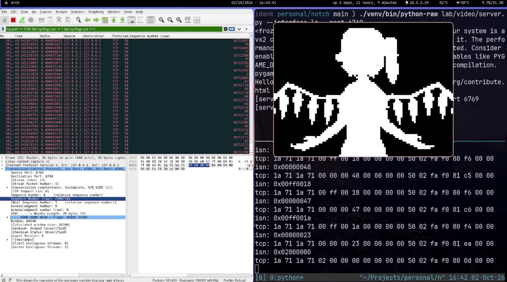
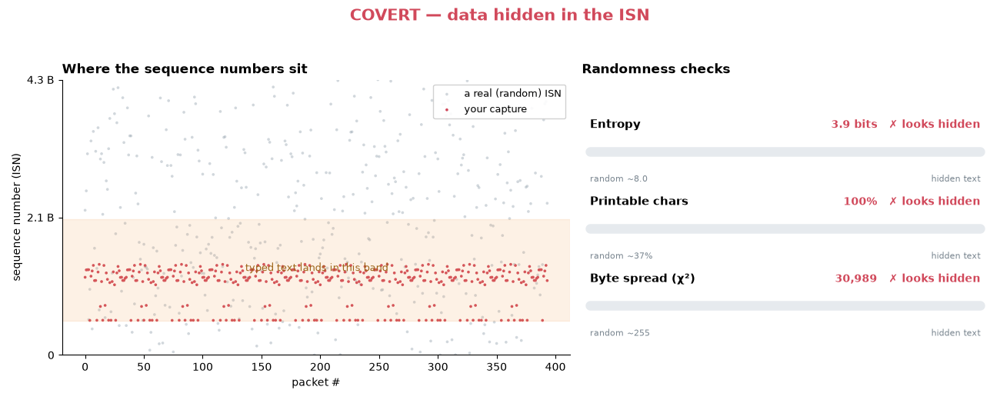

# Notch

Notch is a network steganography tool. It hides arbitrary
payloads inside ordinary-looking traffic, with optional authentication so only a
holder of the shared secret can recover the data.

Prebuilt binaries, when available, are published on
[GitHub Releases](https://github.com/IdanKoblik/notch/releases).

> **Intended for learning and authorized testing only.** Notch demonstrates
> network steganography and can be used offensively. Use it only on systems and
> networks you own or are explicitly authorized to test. You are responsible for
> complying with all applicable laws; use it at your own risk.

## Injection methods

| Method                | Status    | Details                                                                       |
| --------------------- | --------- | ----------------------------------------------------------------------------- |
| TCP SYN ISN injection | Available | Encodes payload data in the Initial Sequence Number (ISN) of TCP SYN packets. |
| ICMP                  | Planned   | Planned transport method.                                                      |

Authenticated mode uses a `SECRET` (via HMAC) so that encoded data can be
verified by the receiver and is not trivially recoverable by an observer.

## Installation

The quickest option is to download a prebuilt binary for your platform from the
[Releases](https://github.com/IdanKoblik/notch/releases) page and make it
executable:

```sh
chmod +x notch
```

To build from source instead, install a recent stable Rust toolchain (via
[rustup](https://rustup.rs/)) and compile with Cargo:

```sh
cargo build --release
```

The resulting binary is at `target/release/notch`.

## Usage

The payload is read from standard input by default. Each authenticated packet
encodes two payload bytes; `--no-auth` encodes four bytes per packet.
Authenticated mode requires the `SECRET` environment variable.

```sh
printf '\x12\x34' | sudo -E target/release/notch inject \
  --dest 192.0.2.10 --interface eth0
```

To read the payload from a file instead, pass its path with `--payload`:

```sh
sudo -E SECRET='shared secret' target/release/notch inject \
  --dest 192.0.2.10 --interface eth0 --payload payload.bin --rate 10
```

The sender prints the injection details and asks for confirmation before
sending. Raw TCP transmission requires `CAP_NET_RAW`, which running under `sudo`
typically provides. Run `notch inject --help` for the full list of options.

Notch is under active development and does not yet include a receiver command.

[](https://www.youtube.com/watch?v=Sb-RUjxPXJo)

## QEMU lab

The `lab/` directory is a [Buildroot](https://buildroot.org/) `BR2_EXTERNAL`
tree that boots Notch inside QEMU virtual machines on an isolated layer-2
network, so the covert channel can be exercised and analyzed safely. Three
scripts in `lab/qemu/` drive it:

| Script           | Run as | Purpose                                                                          |
| ---------------- | ------ | -------------------------------------------------------------------------------- |
| `bridge-up.sh`   | root   | Create the isolated bridge `br-notch` and per-node tap device(s), owned by you.  |
| `run.sh`         | you    | Build Notch, bake it into the role's rootfs via Buildroot, and boot it in QEMU.  |
| `bridge-down.sh` | root   | Remove the tap device(s) and the bridge once empty.                              |

A typical session, from `lab/`:

```sh
sudo ./qemu/bridge-up.sh sender     # once per boot session; creates tap-sender
./qemu/run.sh sender                # as your user; do not sudo (it builds with your Rust toolchain)
sudo ./qemu/bridge-down.sh sender   # tear down when done
```

### Covert-channel analysis

`lab/orchestrator.py` runs a full experiment end to end: it captures SYNs on the
host, drives the VM to run `notch inject`, and then analyzes the captured
traffic. The `lab/isn/` package performs the steganalysis, testing whether the
TCP ISNs look random (a real OS) or carry a hidden payload, and writing a
verdict plus a scorecard image to `lab/results/`.

```sh
cd lab
python3 -m venv .venv && .venv/bin/pip install -r requirements.txt
.venv/bin/python orchestrator.py --mode no-auth     # capture, inject, and analyze
.venv/bin/python -m isn.analyze captures/some.pcap  # analyze an existing capture
```



## Contributing

Contributions, issues, and feature ideas are welcome. See
[CONTRIBUTING.md](CONTRIBUTING.md) for the full guide; in short:

- Build and test with `cargo build` and `cargo test`.
- Run `cargo fmt` and `cargo clippy` before committing. A pre-commit hook under
  `.githooks/` can do the formatting for you, enabled with:

  ```sh
  git config core.hooksPath .githooks
  ```

- Keep pull requests focused, match the existing style, and update tests for any
  behavior you change.

All participants are expected to follow the
[Code of Conduct](CODE_OF_CONDUCT.md).

## License

Notch is licensed under the [GNU GPL-3.0](LICENSE).
